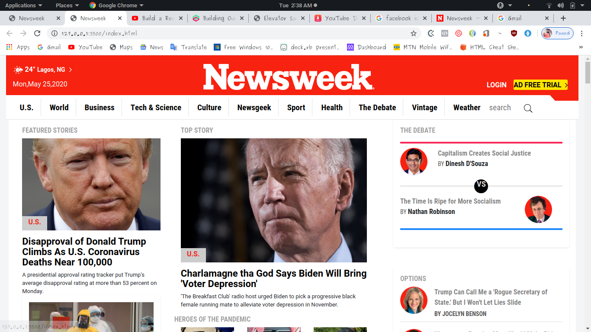

# Bootstrap Project 

> A clone of The Newsweek website.

This page is a basic clone of The Newsweek website, this project has been an exercise of using bootstrap. the main purpose of this project has been to build responsive design using bootstrap and to aquire further practice on using css frameworks such as bootstrap. 

## Built With

- HTML5
- CSS3
- BOOTSTRAP

## Live Demo

Live link here: https://rawcdn.githack.com/ignatius22/Using-Bootstrap/e4288219d8c413eee57c8f25b60549c09772c80d/index.html

## Authors

👤 **Author**
Ignatius Sani:
- Github: https://github.com/ignatius22 
- Linkedin: https://www.linkedin.com/in/ignatius-sani-982b8b186/  

